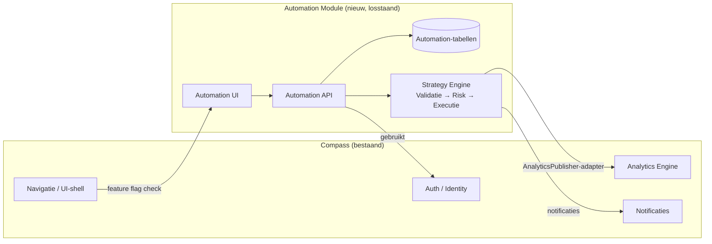
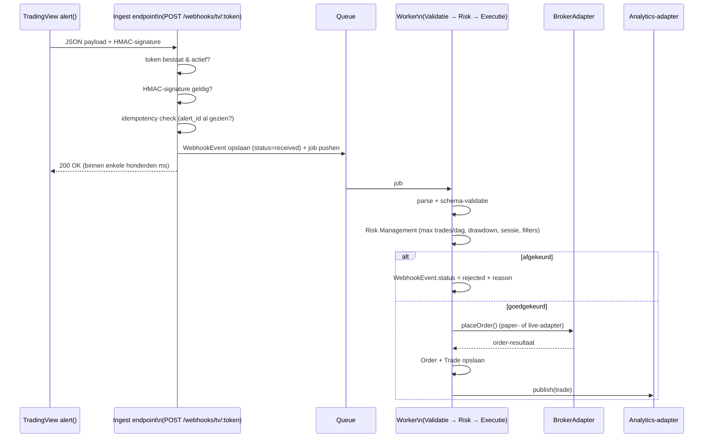

# Compass Automation & Strategy Engine — Technisch Ontwerp

> **Status:** conceptontwerp, geschreven zonder toegang tot de daadwerkelijke
> Compass/`trading-journal`-codebase (dat is een apart repo — zie
> "Belangrijke kanttekening" hieronder). Bedoeld als input voor een
> implementatie-sessie waarin dat repo wél open staat: valideer elke
> aanname tegen de bestaande code voordat je gaat bouwen.

## Belangrijke kanttekening vooraf

Dit repo (`tradingview-bot`) bevat alleen Pine Script-bestanden en een klein
Node/TypeScript webhook-prototype (`bot/`). De root-`README.md` van dit repo
zegt expliciet: *"Staat los van `trading-journal` (Compass)"*. Compass —
met zijn bestaande database, bestaande Analytics Engine en bestaande
gebruikersbeheer — leeft dus in een ander repository waar ik nu niet bij
kan. Dit ontwerp is daarom bewust **technologie-onafhankelijk** opgezet
(geen aannames over taal/framework/database van Compass zelf), met expliciete
aannames waar nodig (zie sectie 14).

Wél bouw ik hieronder concreet voort op wat er in `bot/` al staat, omdat dat
precies de kiem is van de pipeline die je beschrijft:

| Wat er nu al staat (`bot/src/`) | Wordt in dit ontwerp |
|---|---|
| `POST /webhook/tradingview` met één gedeeld `secret` in de body | Per-`StrategyVersion` uniek token + HMAC-signature (§7) |
| `AlertPayload` (ticker/side/price/sl/tp/strategy/timeframe) | Genormaliseerd `Signal`-object, source-agnostisch (§3, §13) |
| `parseAlertPayload()` — schema-validatie | Blijft de eerste stap van de Validatie-fase (§7) |
| `placeOrder()` in `broker.ts` — stub, logt alleen | Wordt een `BrokerAdapter`-implementatie (§8) |
| `logAlert()` — JSON-lines naar `bot/logs/alerts.log` | Wordt `WebhookEvent`/`Order`/`Trade` in de database (§3) — nooit meer alleen een logbestand |
| Eén hardcoded strategie, één broker (cTrader, nog niet geïmplementeerd) | N strategieën × N versies × N brokers, abstract (§3, §8) |

Dit MVP'tje is dus niet iets om weg te gooien — het is Fase 0. De rest van
dit document beschrijft waar het naartoe groeit.

---

## 1. Uitgangspunten

1. **TradingView is uitsluitend signaalbron.** Nooit rechtstreeks naar een
   broker. Alle beslissingslogica (validatie, risk, sizing, routing) zit in
   Compass Backend.
2. **Paper en Live delen exact dezelfde pipeline.** Het enige verschil is de
   laatste stap: welke `BrokerAdapter` de order daadwerkelijk verstuurt. Een
   `PaperBrokerAdapter` implementeert hetzelfde interface en simuleert fills.
3. **Een strategie-versie is onveranderlijk zodra hij trades heeft.** Actieve
   parameters wijzigen zou historische analytics vervuilen — in plaats
   daarvan maak je een nieuwe versie (`V5.1` → `V5.2`) en vergelijk je ze.
4. **Nooit informatie verliezen.** Elk signaal — ook een afgewezen of een
   gefaald signaal — blijft volledig traceerbaar in de database, met reden.
5. **De module is uitschakelbaar zonder de rest van Compass te breken.** Geen
   directe database-joins vanuit de rest van Compass naar automation-tabellen
   — alleen via expliciete interfaces (Auth, Analytics-adapter, notificaties).
6. **Eén generiek `Signal`-model, geen webhook-specifieke kernlogica.** Zodat
   latere signaalbronnen (AI, eigen algoritmes) dezelfde pipeline hergebruiken
   in plaats van een parallel systeem nodig te hebben (zie §13).

---

## 2. Informatiearchitectuur & module-grens



**Toegangscontrole op 3 lagen** (niet slechts UI — dat is puur cosmetisch en
geen beveiliging):

1. **Navigatie:** het "Automation"-tabblad wordt niet gerenderd zonder
   entitlement.
2. **Route guard (frontend):** direct naar een automation-URL navigeren zonder
   entitlement stuurt terug naar een "niet beschikbaar"-pagina.
3. **API-middleware:** elke request naar `/api/automation/**` controleert het
   entitlement server-side, ongeacht wat de UI toont. Dit is de enige laag die
   daadwerkelijk beveiligt.

Entitlement zelf: een `FeatureEntitlement`-record per organisatie/gebruiker
(`automation_module_enabled: bool`, evt. later een plan-tier). Gebruikers
zonder toegang zien geen tab, geen route, geen API-respons anders dan 403/404
— Compass functioneert voor hen alsof de module niet bestaat, zoals gevraagd.

---

## 3. Domeinmodel / database-entiteiten

Alle tabellen met een `automation_`-prefix (of eigen schema), zodat de module
als geheel verwijderbaar is zonder foreign-key-breuken elders in Compass.

### Kernentiteiten

**`Strategy`**
| veld | type | opmerking |
|---|---|---|
| id | uuid | |
| organization_id / user_id | uuid | eigenaarschap |
| name | text | bv. "Liquidity Sweep" |
| description | text | |
| created_at, archived_at | timestamp | |

**`StrategyVersion`** — dé centrale entiteit; bevat de daadwerkelijk
uitvoerbare configuratie. Onveranderlijk zodra `status != draft`.
| veld | type | opmerking |
|---|---|---|
| id | uuid | |
| strategy_id | fk | |
| version_label | text | "V5.1", vrij tekstveld, geen auto-increment-dwang |
| status | enum | `draft` / `active` / `paused` / `archived` |
| mode | enum | `off` / `paper` / `live` — **hier**, niet los ingesteld per trade |
| broker_account_id | fk, nullable | verplicht zodra mode ≠ off |
| assets | jsonb / aparte m:n-tabel | één of meerdere symbolen |
| timeframes | jsonb / aparte m:n-tabel | |
| risk_per_trade_pct | numeric | |
| max_trades_per_day | int | |
| max_drawdown_pct | numeric | kill-switch-drempel |
| parameters | jsonb | vrij schema, per strategie-"type" — zie §13 (extensibiliteit) |
| filters | jsonb | bv. sessie-filters, min. strength, etc. |
| created_at, activated_at, deactivated_at | timestamp | |

**`SessionDefinition`** (herbruikbaar) + **`StrategyVersionSession`** (m:n) —
naam, timezone, dagen, start/eind-tijd (bv. "London", "New York").

**`Webhook`**
| veld | type | opmerking |
|---|---|---|
| id | uuid | |
| strategy_version_id | fk, 1:1 | |
| url_token | text, uniek, unguessable | onderdeel van de webhook-URL |
| hmac_secret | text, **encrypted** | voor payload-signing, niet in de body zoals nu in `bot/` |
| is_active | bool | |
| last_received_at | timestamp | |

**`WebhookEvent`** (= gegeneraliseerd `Signal`) — de opvolger van
`logAlert()`'s regel in `alerts.log`, maar dan queryable en met volledige
lifecycle:
| veld | type | opmerking |
|---|---|---|
| id | uuid | |
| webhook_id | fk | |
| received_at | timestamp | |
| raw_payload | jsonb | ruwe TradingView-body, ongewijzigd bewaard |
| signature_valid | bool | |
| idempotency_key | text | TradingView's eigen alert-id, of hash van payload+tijdvenster |
| parsed_signal | jsonb | genormaliseerd: direction/symbol/price/sl/tp/timeframe |
| status | enum | `received` → `validated`/`rejected` → `queued` → `processed`/`error` |
| rejection_reason | text, nullable | **nooit stilzwijgend weggooien** |

**`RiskEvaluation`**
| veld | type |
|---|---|
| id | uuid |
| webhook_event_id | fk |
| passed | bool |
| checks | jsonb — bv. `{max_trades_today: {limit:5, current:3, ok:true}, session: {ok:true}, drawdown: {ok:true}}` |
| computed_qty, computed_risk_amount | numeric |

**`Order`**
| veld | type |
|---|---|
| id | uuid |
| strategy_version_id, webhook_event_id, broker_account_id | fk |
| mode | `paper` / `live` |
| side, order_type | |
| requested_price, requested_qty, sl, tp | numeric |
| status | `pending`/`submitted`/`filled`/`partially_filled`/`cancelled`/`rejected`/`error` |
| broker_order_id | text, nullable |
| broker_response | jsonb |
| execution_latency_ms | int |

**`Trade`** — het record dat naar de gedeelde Analytics Engine gepubliceerd
wordt (zie §9). Bevat letterlijk elk veld dat je noemde: entry, exit, sl, tp,
risk, resultaat, R-multiple, strategie, versie, sessie, ATR, volume, trend,
screenshots, webhook-payload-ref, broker-response-ref, execution latency.

**`BrokerAccount`**
| veld | type |
|---|---|
| id | uuid |
| broker_type | enum: `mexc`/`tradovate`/`ctrader`/`mt5`/`paper` |
| label | text |
| credentials_encrypted | bytes (vault/KMS) |
| status | `connected`/`disconnected`/`error` |
| capabilities | jsonb — ondersteunde ordertypes/assets/rate-limits |
| last_health_check_at | timestamp |

**`AuditLog`** — generiek, voor gevoelige acties (broker koppelen, mode-wissel
paper→live, secret-rotatie, activeren/deactiveren).

### Ontwerpkeuzes die opvallen

- **Geen aparte "analytics fact table"** — trades worden gepubliceerd in het
  bestaande Compass-model (§9), niet gedupliceerd naar een eigen
  analytics-store.
- **Geen aparte parameter-audit-tabel** — omdat een actieve versie
  onveranderlijk is, IS de reeks versies zelf al de audit trail. Edits vóór
  activatie hoeven niet apart gelogd te worden.

---

## 4. Schermstructuur

```
Automation (root, alleen zichtbaar met entitlement)
├── Dashboard              overzicht: actieve strategieën, laatste signalen/
│                          orders, broker-status, foutmeldingen
├── Strategieën (lijst)
│   └── Strategie-detail
│       ├── Dashboard      winrate, PF, expectancy, avg RR, equity curve,
│       │                  drawdown, open trades
│       ├── Versies        lijst + vergelijken + activeren + dupliceren
│       ├── Instellingen   naam, assets, timeframes, risk, max trades/dag,
│       │                  max DD, sessies, filters, parameters, mode,
│       │                  broker, webhook-URL/secret
│       ├── Signalen       log van binnenkomende webhooks + resulterende
│       │                  orders, met status (incl. afgewezen signalen)
│       └── Trades         volledige trade-log voor deze strategie/versie
├── Brokers                connections, health, credentials, capabilities
├── Webhooks               alle endpoints, laatste ontvangst, secret-rotatie
├── Trade Log              globaal, filterbaar over alle strategieën
├── Analytics              hergebruikt bestaande Compass Analytics-UI met
│                          extra filter-dimensies (§9)
├── Backtesting            placeholder-tab voor §13
└── Instellingen           module-brede defaults, notificatie-voorkeuren
```

---

## 5. Kern-gebruikersflows

**A. Nieuwe strategie + versie opzetten**
Strategie aanmaken → eerste versie (`draft`) → parameters invullen → broker
koppelen (of "paper" kiezen, geen broker nodig) → webhook-token +
HMAC-secret worden gegenereerd → deze in de Pine-strategie's `alert()`-call
zetten → versie activeren (`draft` → `active`, mode blijft `off` tot
bewust omgezet).

**B. Van signaal tot trade** — zie het volledige diagram in §7.

**C. Paper → Live promotie**
Expliciete actie met bevestigingsdialoog (niet één klik) — gelogd in
`AuditLog`. Vereist een gekoppelde, gezonde `BrokerAccount`. De pipeline zelf
verandert niet; alleen de laatste stap (BrokerAdapter) wisselt.

**D. Versies vergelijken**
Strategie-detail → Versies-tab → selecteer V5.2 en V6 → Analytics-view filtert
automatisch op `strategy_version_id IN (...)` en toont beide equity curves
naast elkaar.

**E. Broker koppelen**
Brokers-tab → "Nieuwe broker" → kies type → OAuth/API-key-flow specifiek voor
dat type (achter de `BrokerAdapter`-abstractie, zie §8) → credentials worden
versleuteld opgeslagen → health-check bevestigt de koppeling.

---

## 6. API-structuur (REST, voorbeeld)

Namespace: `/api/automation/v1/...` — beschermd door de entitlement-middleware
uit §2.

```
POST   /strategies
GET    /strategies
GET    /strategies/:id
POST   /strategies/:id/versions
GET    /strategies/:id/versions
PATCH  /versions/:id                 (alleen terwijl status=draft)
POST   /versions/:id/activate
POST   /versions/:id/mode            body: { mode: "off"|"paper"|"live" }
GET    /versions/:id/dashboard
POST   /versions/:id/webhook/rotate-secret

GET    /brokers
POST   /brokers                      (connect)
DELETE /brokers/:id
GET    /brokers/:id/health

GET    /signals?strategy_version_id=&status=&from=&to=
GET    /orders?...
GET    /trades?source=&mode=&strategy_id=&version_id=&broker_id=&asset=&session=&timeframe=&from=&to=
```

Publiek, *niet* onder `/api/automation/**` en dus niet onder de
entitlement-middleware (moet immers bereikbaar zijn voordat iemand is
ingelogd) maar wél zwaar beveiligd op eigen wijze (§7, §11):

```
POST   /webhooks/tv/:token
```

---

## 7. Webhook-architectuur



Belangrijke eigenschappen:

- **Ingest-endpoint blijft "dom en snel"** — schrijft alleen weg en queuet,
  geen zware logica. Dit ontkoppelt TradingView's alert-timeout-gevoeligheid
  van de daadwerkelijke verwerkingstijd (Risk/Executie kan best 1-2 sec
  duren zonder dat TradingView een timeout ziet).
- **Idempotency verplicht** — TradingView is bekend om alerts soms dubbel te
  versturen (herstart, vertraging). Een `idempotency_key` (TradingView's eigen
  alert-nonce, of een hash van payload binnen een tijdvenster) voorkomt
  dubbele orders.
- **HMAC + unguessable token**, niet het huidige gedeelde `secret`-in-de-body
  patroon uit `bot/` — dat werkt voor één MVP-strategie, maar met N
  strategie-versies wil je per versie een eigen, roteerbaar secret zonder dat
  het lekken van de ene strategie's secret de andere raakt.
- **Nooit stil falen** — elke afwijzing (ongeldige payload, verkeerde
  signature, risk-check gefaald) blijft volledig zichtbaar in de
  Signalen-tab met reden, exact zoals gevraagd ("ik wil nooit informatie
  verliezen").

---

## 8. Broker-architectuur

Eén interface, meerdere implementaties — nieuwe brokers toevoegen raakt nooit
de rest van de code:

```ts
interface BrokerAdapter {
  connect(credentials: BrokerCredentials): Promise<void>;
  healthCheck(): Promise<BrokerHealth>;
  getCapabilities(): BrokerCapabilities;   // ordertypes, assets, rate limits
  placeOrder(order: OrderRequest): Promise<BrokerOrderResult>;
  cancelOrder(brokerOrderId: string): Promise<void>;
  getOrderStatus(brokerOrderId: string): Promise<OrderStatus>;
  getPositions(): Promise<Position[]>;
  getAccountBalance(): Promise<Balance>;
}
```

- `MexcAdapter`, `TradovateAdapter`, `CTraderAdapter`, `MT5Adapter`,
  `PaperBrokerAdapter` (simuleert fills tegen laatste/live prijs — zelfde
  interface, dus paper vs live is voor de rest van de pipeline onzichtbaar).
- **MT5 heeft geen goede directe REST-API** — dit vraagt vermoedelijk om een
  losse "Execution Agent" (klein proces op een VPS naast het MT5-terminal,
  communiceert via een beveiligd kanaal terug naar Compass). Compass-kant
  blijft broker-agnostisch dankzij de adapter-interface; dit is het meest
  onzekere stuk van dit ontwerp en verdient eigen discovery (zie §14).
- **cTrader**: `bot/src/broker.ts` is hier al de aanzet voor — de
  `placeOrder()`-stub wordt de `CTraderAdapter.placeOrder()`-implementatie,
  inclusief de OAuth-trading-scope die het `bot/README.md` al noemt als
  openstaande stap ("opnieuw autoriseren, losstaand van de leesrechten-
  koppeling in trading-journal" — dus trading-journal/Compass heeft
  blijkbaar al een *read-only* cTrader-koppeling; deze module heeft een
  eigen, aparte *trading*-scope nodig).
- **Credentials nooit plat in de database** — versleuteld via een
  secrets-manager/KMS, alleen in-memory gedecrypt op het moment van een
  broker-call.
- **Capabilities als metadata** (welke ordertypes/assets/rate-limits) zodat
  de Risk/Executie-laag weet wat wel/niet kan, zonder broker-specifieke
  `if`-statements buiten de adapter.

---

## 9. Analytics-model

**Geen nieuwe analytics-engine.** Trades worden via een dunne
`AutomationAnalyticsPublisher`-adapter naar hetzelfde trade-model gepusht dat
de bestaande Compass Analytics al gebruikt, met extra dimensie-tags:

- `source`: `manual` / `tradingview` / `automatic`
- `mode`: `paper` / `live` (later ook `backtest`, zie §13)
- `strategy_id`, `strategy_version_id`
- `broker_id`, `asset`, `session`, `timeframe`

Vergelijkingen (handmatig vs automatisch, paper vs live, V5 vs V6) zijn dan
simpelweg filter-combinaties op dezelfde bestaande analytics-queries — geen
aparte vergelijkings-engine nodig, en de rest van Compass' analytics-code
hoeft niets te weten over de interne automation-tabellen.

---

## 10. Beveiliging

- Entitlement-gate op 3 lagen (§2).
- Webhook: unguessable per-versie token + HMAC-signature + rate-limiting +
  idempotency (§7) — een reële verbetering t.o.v. het huidige ene gedeelde
  `secret` in `bot/.env`.
- Broker-credentials: encrypted at rest, aparte secrets-store, nooit gelogd
  (ook niet in error-stack-traces — expliciete scrubbing van gevoelige velden
  vóórdat iets naar logs/monitoring gaat).
- `AuditLog` voor elke gevoelige actie: broker koppelen/loskoppelen,
  mode-wissel paper→live, secret-rotatie, activeren/deactiveren van een
  versie.
- Rate-limiting zowel op de webhook-ingest als (los daarvan) op uitgaande
  broker-calls, met respect voor de rate-limits van elke broker.
- Least-privilege: de Executie-service krijgt alleen de credentials van de
  ene `BrokerAccount` die het op dat moment nodig heeft, geen globale
  credential-pool.

---

## 11. Schaalbaarheid

- Ingest-endpoint is bewust minimaal (schrijf + queue) — alle zware logica
  async in workers, zodat TradingView's timeout nooit het knelpunt is.
- Workers zijn stateless en horizontaal schaalbaar; concurrency-limieten per
  strategie/organisatie voorkomen dat één drukke strategie de queue verstopt
  voor anderen (multi-tenant fairness — relevant zodra dit ooit voor andere
  gebruikers opengaat, zoals je zelf al noemt).
- Broker-calls zijn de echte bottleneck (externe rate-limits) — een
  per-`BrokerAccount` token-bucket/rate-limiter voorkomt dat de worker-laag
  een broker's limiet overschrijdt.
- Analytics-queries (read-heavy) draaien idealiter tegen een read-replica of
  de bestaande Compass Analytics-store, niet tegen de operationele
  (write-heavy) automation-database.

---

## 12. Ontwerpprincipe voor uitbreidbaarheid

De pipeline is bewust rond een generiek `Signal`-object gebouwd, niet rond
"TradingView webhook" specifiek:

```
SignalSource → Signal → Validatie → Risk → Executie (BrokerAdapter) → Trade → Analytics
```

Zolang een bron een genormaliseerd signaal aflevert (direction/symbol/price/
sl/tp/timeframe), is de rest van het systeem source-agnostisch. Dat maakt de
volgende uitbreidingen aanpassingen aan de RANDEN, niet aan de kern:

- **AI/ML-signalen, eigen algoritmes** — gewoon een andere `SignalSource`.
- **Backtesting** — een offline engine die `StrategyVersion`-parameters +
  historische bars omzet in gesimuleerde `Trade`-records met `mode=backtest`,
  die weer gewoon door dezelfde Analytics-vergelijking heen kunnen.
- **Parameter-optimalisatie / Monte Carlo** — bouwt bovenop backtesting als
  een job-type dat een reeks `StrategyVersion`-varianten genereert en
  bulk-backtest.
- **Walk-Forward Testing** — een geautomatiseerde reeks (train-venster,
  test-venster)-backtests, resultaten in een eigen `WalkForwardRun`-entiteit
  die naar de losse runs verwijst.
- **Portfolio-allocatie / meerdere accounts** — `BrokerAccount` is al 1:veel
  per gebruiker; een `PortfolioAllocationRule` erbovenop kan later zonder het
  kernmodel te breken.
- **Copy trading / marketplace** — een `is_published`-vlag op
  `StrategyVersion` + een `Subscription`-entiteit (volger → gepubliceerde
  strategie) die signalen laat "vermenigvuldigen" naar elke volger's eigen
  risk/broker-instellingen. Hergebruikt exact dezelfde
  Validatie→Risk→Executie-pipeline per volger — geen aparte copy-trading-
  engine nodig.
- **VPS-deployments** — voor brokers zonder goede REST-API (MT5, zie §8) een
  losse Execution Agent, communicerend via een beveiligd kanaal; de
  Compass-kant blijft broker-agnostisch.

---

## 13. Openstaande beslissingen (in te vullen bij implementatie)

1. **Techstack van Compass zelf** (taal/framework/database) — dit ontwerp is
   bewust stack-onafhankelijk; vul dit in zodra je in het `trading-journal`-
   repo werkt.
2. **Exacte vorm van de bestaande Analytics Engine's fact-model** — de
   `AutomationAnalyticsPublisher`-adapter (§9) moet daarop aangepast worden;
   dit ontwerp gaat uit van een gedeeld "trade fact"-model maar kent het
   werkelijke schema niet.
3. **Message-queue-keuze** (Redis/BullMQ, SQS, RabbitMQ, ...) — afhankelijk
   van wat Compass al gebruikt of een nieuwe keuze.
4. **MT5-koppeling** — vermoedelijk een losse Execution Agent nodig (§8),
   vraagt meer discovery dan de andere brokers.
5. **cTrader trading-scope** — `bot/README.md` noemt al dat trading-journal
   een *read-only* cTrader-koppeling heeft; deze module heeft een eigen,
   apart geautoriseerde *trading*-scope nodig, los daarvan.
6. **Precieze vorm van "filters"** in `StrategyVersion.filters` — je noemt
   "Filters" als losse instelling naast "Parameters"; verduidelijk bij
   implementatie het onderscheid (bv. filters = harde in/uit-voorwaarden,
   parameters = strategie-specifieke getallen).
